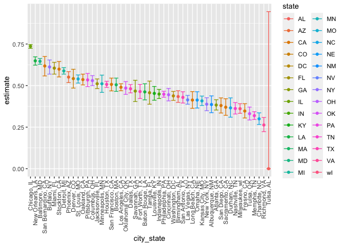
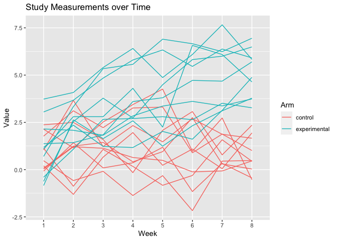

HW5
================
Lauren Richter
2021-11-20

## Problem 1

    ## Rows: 52179 Columns: 12
    ## ── Column specification ────────────────────────────────────────────────────────
    ## Delimiter: ","
    ## chr (9): uid, victim_last, victim_first, victim_race, victim_age, victim_sex...
    ## dbl (3): reported_date, lat, lon
    ## 
    ## ℹ Use `spec()` to retrieve the full column specification for this data.
    ## ℹ Specify the column types or set `show_col_types = FALSE` to quiet this message.
    ## `summarise()` has grouped output by 'city_state', 'disposition'. You can override using the `.groups` argument.
    ## # A tibble: 6 × 3
    ## # Groups:   city_state [6]
    ##   city_state      n_unsolved total_homicides
    ##   <fct>                <int>           <int>
    ## 1 Albuquerque, NM        146             378
    ## 2 Atlanta, GA            373             973
    ## 3 Baltimore, MD         1825            2827
    ## 4 Baton Rouge, LA        196             424
    ## 5 Birmingham, AL         347             800
    ## 6 Boston, MA             310             614

The raw data includes 52179 observations of 12 variables for homicides
in the 50 largest US cities (by population in 2012). Each record
includes information about the victim, the date of the report, the
location of the homicide, and the disposition of the case (whether an
arrest was made). The named variables are uid, reported_date,
victim_last, victim_first, victim_race, victim_age, victim_sex, city,
state, lat, lon, disposition. More information about the data is
available from the original data source,
[here](https://github.com/washingtonpost/data-homicides).

    ## # A tibble: 1 × 6
    ##   city_state    n_unsolved total_homicides estimate conf_low conf_high
    ##   <chr>              <int>           <int>    <dbl>    <dbl>     <dbl>
    ## 1 Baltimore, MD       1825            2827    0.646    0.628     0.663

For the city of Baltimore, MD, the estimated proportion is 0.646 (95%
confidence interval \[0.628, 0.663\])

Doing this for all of the cities as follows:

``` r
homicide_df = homicide_df %>% 
  group_by(city_state) %>% 
  mutate(
    test_results = map2(n_unsolved, total_homicides, prop.test),
    tidy_results = map(test_results, broom::tidy)
  ) %>% 
  select(city_state, n_unsolved, total_homicides, tidy_results) %>% 
  unnest(tidy_results) %>% 
  select(city_state, n_unsolved, total_homicides, estimate, conf.low, conf.high) %>% 
  mutate(estimate = round(estimate, 3),
         conf.low = round(conf.low,3),
         conf.high = round(conf.high,3)) %>%
  janitor::clean_names("snake")
## Warning in .f(.x[[1L]], .y[[1L]], ...): Chi-squared approximation may be
## incorrect

homicide_df
## # A tibble: 51 × 6
## # Groups:   city_state [51]
##    city_state      n_unsolved total_homicides estimate conf_low conf_high
##    <fct>                <int>           <int>    <dbl>    <dbl>     <dbl>
##  1 Albuquerque, NM        146             378    0.386    0.337     0.438
##  2 Atlanta, GA            373             973    0.383    0.353     0.415
##  3 Baltimore, MD         1825            2827    0.646    0.628     0.663
##  4 Baton Rouge, LA        196             424    0.462    0.414     0.511
##  5 Birmingham, AL         347             800    0.434    0.399     0.469
##  6 Boston, MA             310             614    0.505    0.465     0.545
##  7 Buffalo, NY            319             521    0.612    0.569     0.654
##  8 Charlotte, NC          206             687    0.3      0.266     0.336
##  9 Chicago, IL           4073            5535    0.736    0.724     0.747
## 10 Cincinnati, OH         309             694    0.445    0.408     0.483
## # … with 41 more rows
```

Cities shown with estimated proportion of unsolved homicides (95%
confidence interval). Tulsa, AL appears to be an outlier and is included
for completeness.

``` r
homicide_df %>% 
  ungroup() %>%
  mutate(city_state = fct_reorder(city_state, desc(estimate))) %>%
  mutate(state = str_sub(city_state, start = -2, end = -1)) %>%
  ggplot(aes(x = city_state, y = estimate, color = state)) +
  geom_point() + 
  geom_errorbar(aes(ymin = conf_low, ymax = conf_high)) +
  theme(axis.text.x = element_text(angle = 90, vjust = 0.5, hjust = 1))
```

<!-- -->

## Problem 2

The original data from the longitudinal study was tidied by combining
each individual participant’s data into one large dataframe.

``` r
file_names = c(files = list.files("data/study_data/"))

read_multi_csv = function(csv_list) {
  data_df = tibble(
    subject_id = substr(csv_list, 1, 6), 
    study_arm = substr(csv_list, 1, 3), 
    read_csv(str_c("data/study_data/", csv_list), show_col_types = FALSE))
  return(data_df)
}

study_data = map_dfr(file_names, read_multi_csv) %>% 
  mutate(
    study_arm = ifelse(study_arm == "con", "control", "experimental")
  ) %>%
  select(study_arm, everything())

knitr:::kable(study_data)
```

| study_arm    | subject_id | week_1 | week_2 | week_3 | week_4 | week_5 | week_6 | week_7 | week_8 |
|:-------------|:-----------|-------:|-------:|-------:|-------:|-------:|-------:|-------:|-------:|
| control      | con_01     |   0.20 |  -1.31 |   0.66 |   1.96 |   0.23 |   1.09 |   0.05 |   1.94 |
| control      | con_02     |   1.13 |  -0.88 |   1.07 |   0.17 |  -0.83 |  -0.31 |   1.58 |   0.44 |
| control      | con_03     |   1.77 |   3.11 |   2.22 |   3.26 |   3.31 |   0.89 |   1.88 |   1.01 |
| control      | con_04     |   1.04 |   3.66 |   1.22 |   2.33 |   1.47 |   2.70 |   1.87 |   1.66 |
| control      | con_05     |   0.47 |  -0.58 |  -0.09 |  -1.37 |  -0.32 |  -2.17 |   0.45 |   0.48 |
| control      | con_06     |   2.37 |   2.50 |   1.59 |  -0.16 |   2.08 |   3.07 |   0.78 |   2.35 |
| control      | con_07     |   0.03 |   1.21 |   1.13 |   0.64 |   0.49 |  -0.12 |  -0.07 |   0.46 |
| control      | con_08     |  -0.08 |   1.42 |   0.09 |   0.36 |   1.18 |  -1.16 |   0.33 |  -0.44 |
| control      | con_09     |   0.08 |   1.24 |   1.44 |   0.41 |   0.95 |   2.75 |   0.30 |   0.03 |
| control      | con_10     |   2.14 |   1.15 |   2.52 |   3.44 |   4.26 |   0.97 |   2.73 |  -0.53 |
| experimental | exp_01     |   3.05 |   3.67 |   4.84 |   5.80 |   6.33 |   5.46 |   6.38 |   5.91 |
| experimental | exp_02     |  -0.84 |   2.63 |   1.64 |   2.58 |   1.24 |   2.32 |   3.11 |   3.78 |
| experimental | exp_03     |   2.15 |   2.08 |   1.82 |   2.84 |   3.36 |   3.61 |   3.37 |   3.74 |
| experimental | exp_04     |  -0.62 |   2.54 |   3.78 |   2.73 |   4.49 |   5.82 |   6.00 |   6.49 |
| experimental | exp_05     |   0.70 |   3.33 |   5.34 |   5.57 |   6.90 |   6.66 |   6.24 |   6.95 |
| experimental | exp_06     |   3.73 |   4.08 |   5.40 |   6.41 |   4.87 |   6.09 |   7.66 |   5.83 |
| experimental | exp_07     |   1.18 |   2.35 |   1.23 |   1.17 |   2.02 |   1.61 |   3.13 |   4.88 |
| experimental | exp_08     |   1.37 |   1.43 |   1.84 |   3.60 |   3.80 |   4.72 |   4.68 |   5.70 |
| experimental | exp_09     |  -0.40 |   1.08 |   2.66 |   2.70 |   2.80 |   2.64 |   3.51 |   3.27 |
| experimental | exp_10     |   1.09 |   2.80 |   2.80 |   4.30 |   2.25 |   6.57 |   6.09 |   4.64 |

A spaghetti plot showing observations for each subject over time reveals
a trend that the experimental group, but not the control group, sees a
rise in the study value over time.

``` r
study_data %>% 
  pivot_longer(week_1:week_8, names_to = "week", 
    names_prefix = "week_") %>%
  ggplot(aes(x = week, y = value)) +
  geom_line(aes(group = subject_id, color = study_arm)) + 
  labs(
    title = "Study Measurements over Time", 
    y = "Value",
    x = "Week", 
    color = "Arm"
  ) 
```

<!-- -->

## Problem 3

Creating an iris dataset with missing data. The code below will replace
20 random observations with NA values.

``` r
library(tidyverse)
set.seed(10)
iris_with_missing = iris %>% 
  map_df(~replace(.x, sample(1:150, 20), NA)) %>%
  mutate(Species = as.character(Species))
```

The function below takes a variable vector as an argument and replaces
the missing values as follows: - Filling in the missing numeric
variables with the mean of the non-missing values. - Filling in missing
character variables with “virginica”

There were 100 missing values in the `iris_with_missing` dataset, of
which 20 were character variables. This corresponds to 20 missing
observations (5 variables).

``` r
replace_na = function(var_vec) {
  if (is.numeric(var_vec)) {
    var_vec = ifelse(is.na(var_vec), 
                     round(mean(var_vec, na.rm = TRUE), 3), 
                     round(var_vec, 3))
  }
  else if (is.character(var_vec)) {
    var_vec = ifelse(is.na(var_vec), 
                     "virginica", 
                     var_vec)
  }
  return(var_vec)
}

found_iris = map_df(iris_with_missing, replace_na)
```
